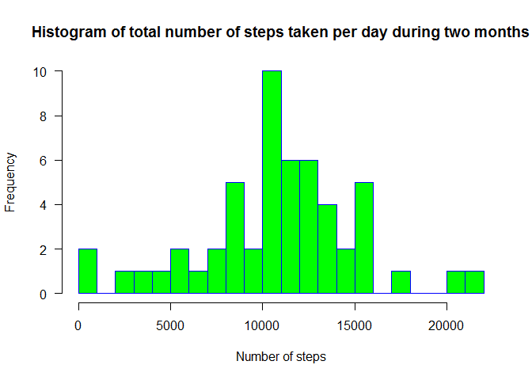
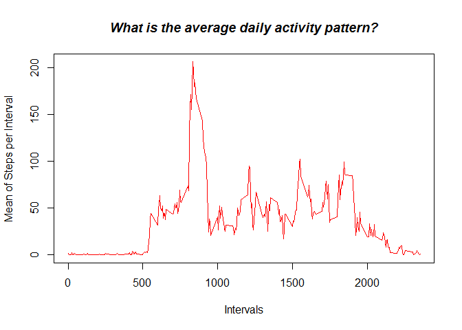
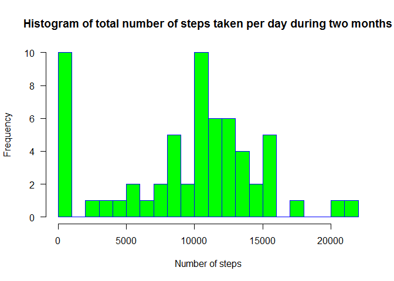

# Reproducible Research: Peer Assessment 1

##Assignment only partly completed, started too late

## Loading and preprocessing the data

```r
      data <- read.csv("activity.csv")
```

```r
## What is mean total number of steps taken per day?
```

```r
      s <-split(data,data$"date")
      tb = lapply(s, function(x) colSums(x[,c("steps","interval")], na.rm = FALSE))
      df<-data.frame(Reduce(rbind, tb))
```

```
## Warning in data.row.names(row.names, rowsi, i): some row.names duplicated:
## 3,4,5,6,7,8,9,10,11,12,13,14,15,16,17,18,19,20,21,22,23,24,25,26,27,28,29,30,31,32,33,34,35,36,37,38,39,40,41,42,43,44,45,46,47,48,49,50,51,52,53,54,55,56,57,58,59,60,61
## --> row.names NOT used
```

```r
      colnames(df) <- c("SumOfSteps","Interval")
      hist(df$"SumOfSteps", 
      main="Histogram of total number of steps taken per day during two months", 
      xlab="Number of steps", 
      xlim=c(0, 22000),
      border="blue", 
      col="green",
      breaks=22,
      las=1)
```

 

```r
      ##Mean of steps
      by(data[, "steps"], data[, "date"], mean)
```

```
## data[, "date"]: 2012-10-01
## [1] NA
## -------------------------------------------------------- 
## data[, "date"]: 2012-10-02
## [1] 0.4375
## -------------------------------------------------------- 
## data[, "date"]: 2012-10-03
## [1] 39.41667
## -------------------------------------------------------- 
## data[, "date"]: 2012-10-04
## [1] 42.06944
## -------------------------------------------------------- 
## data[, "date"]: 2012-10-05
## [1] 46.15972
## -------------------------------------------------------- 
## data[, "date"]: 2012-10-06
## [1] 53.54167
## -------------------------------------------------------- 
## data[, "date"]: 2012-10-07
## [1] 38.24653
## -------------------------------------------------------- 
## data[, "date"]: 2012-10-08
## [1] NA
## -------------------------------------------------------- 
## data[, "date"]: 2012-10-09
## [1] 44.48264
## -------------------------------------------------------- 
## data[, "date"]: 2012-10-10
## [1] 34.375
## -------------------------------------------------------- 
## data[, "date"]: 2012-10-11
## [1] 35.77778
## -------------------------------------------------------- 
## data[, "date"]: 2012-10-12
## [1] 60.35417
## -------------------------------------------------------- 
## data[, "date"]: 2012-10-13
## [1] 43.14583
## -------------------------------------------------------- 
## data[, "date"]: 2012-10-14
## [1] 52.42361
## -------------------------------------------------------- 
## data[, "date"]: 2012-10-15
## [1] 35.20486
## -------------------------------------------------------- 
## data[, "date"]: 2012-10-16
## [1] 52.375
## -------------------------------------------------------- 
## data[, "date"]: 2012-10-17
## [1] 46.70833
## -------------------------------------------------------- 
## data[, "date"]: 2012-10-18
## [1] 34.91667
## -------------------------------------------------------- 
## data[, "date"]: 2012-10-19
## [1] 41.07292
## -------------------------------------------------------- 
## data[, "date"]: 2012-10-20
## [1] 36.09375
## -------------------------------------------------------- 
## data[, "date"]: 2012-10-21
## [1] 30.62847
## -------------------------------------------------------- 
## data[, "date"]: 2012-10-22
## [1] 46.73611
## -------------------------------------------------------- 
## data[, "date"]: 2012-10-23
## [1] 30.96528
## -------------------------------------------------------- 
## data[, "date"]: 2012-10-24
## [1] 29.01042
## -------------------------------------------------------- 
## data[, "date"]: 2012-10-25
## [1] 8.652778
## -------------------------------------------------------- 
## data[, "date"]: 2012-10-26
## [1] 23.53472
## -------------------------------------------------------- 
## data[, "date"]: 2012-10-27
## [1] 35.13542
## -------------------------------------------------------- 
## data[, "date"]: 2012-10-28
## [1] 39.78472
## -------------------------------------------------------- 
## data[, "date"]: 2012-10-29
## [1] 17.42361
## -------------------------------------------------------- 
## data[, "date"]: 2012-10-30
## [1] 34.09375
## -------------------------------------------------------- 
## data[, "date"]: 2012-10-31
## [1] 53.52083
## -------------------------------------------------------- 
## data[, "date"]: 2012-11-01
## [1] NA
## -------------------------------------------------------- 
## data[, "date"]: 2012-11-02
## [1] 36.80556
## -------------------------------------------------------- 
## data[, "date"]: 2012-11-03
## [1] 36.70486
## -------------------------------------------------------- 
## data[, "date"]: 2012-11-04
## [1] NA
## -------------------------------------------------------- 
## data[, "date"]: 2012-11-05
## [1] 36.24653
## -------------------------------------------------------- 
## data[, "date"]: 2012-11-06
## [1] 28.9375
## -------------------------------------------------------- 
## data[, "date"]: 2012-11-07
## [1] 44.73264
## -------------------------------------------------------- 
## data[, "date"]: 2012-11-08
## [1] 11.17708
## -------------------------------------------------------- 
## data[, "date"]: 2012-11-09
## [1] NA
## -------------------------------------------------------- 
## data[, "date"]: 2012-11-10
## [1] NA
## -------------------------------------------------------- 
## data[, "date"]: 2012-11-11
## [1] 43.77778
## -------------------------------------------------------- 
## data[, "date"]: 2012-11-12
## [1] 37.37847
## -------------------------------------------------------- 
## data[, "date"]: 2012-11-13
## [1] 25.47222
## -------------------------------------------------------- 
## data[, "date"]: 2012-11-14
## [1] NA
## -------------------------------------------------------- 
## data[, "date"]: 2012-11-15
## [1] 0.1423611
## -------------------------------------------------------- 
## data[, "date"]: 2012-11-16
## [1] 18.89236
## -------------------------------------------------------- 
## data[, "date"]: 2012-11-17
## [1] 49.78819
## -------------------------------------------------------- 
## data[, "date"]: 2012-11-18
## [1] 52.46528
## -------------------------------------------------------- 
## data[, "date"]: 2012-11-19
## [1] 30.69792
## -------------------------------------------------------- 
## data[, "date"]: 2012-11-20
## [1] 15.52778
## -------------------------------------------------------- 
## data[, "date"]: 2012-11-21
## [1] 44.39931
## -------------------------------------------------------- 
## data[, "date"]: 2012-11-22
## [1] 70.92708
## -------------------------------------------------------- 
## data[, "date"]: 2012-11-23
## [1] 73.59028
## -------------------------------------------------------- 
## data[, "date"]: 2012-11-24
## [1] 50.27083
## -------------------------------------------------------- 
## data[, "date"]: 2012-11-25
## [1] 41.09028
## -------------------------------------------------------- 
## data[, "date"]: 2012-11-26
## [1] 38.75694
## -------------------------------------------------------- 
## data[, "date"]: 2012-11-27
## [1] 47.38194
## -------------------------------------------------------- 
## data[, "date"]: 2012-11-28
## [1] 35.35764
## -------------------------------------------------------- 
## data[, "date"]: 2012-11-29
## [1] 24.46875
## -------------------------------------------------------- 
## data[, "date"]: 2012-11-30
## [1] NA
```

```r
      ##Median of steps
      by(data[, "steps"], data[, "date"], median)
```

```
## data[, "date"]: 2012-10-01
## [1] NA
## -------------------------------------------------------- 
## data[, "date"]: 2012-10-02
## [1] 0
## -------------------------------------------------------- 
## data[, "date"]: 2012-10-03
## [1] 0
## -------------------------------------------------------- 
## data[, "date"]: 2012-10-04
## [1] 0
## -------------------------------------------------------- 
## data[, "date"]: 2012-10-05
## [1] 0
## -------------------------------------------------------- 
## data[, "date"]: 2012-10-06
## [1] 0
## -------------------------------------------------------- 
## data[, "date"]: 2012-10-07
## [1] 0
## -------------------------------------------------------- 
## data[, "date"]: 2012-10-08
## [1] NA
## -------------------------------------------------------- 
## data[, "date"]: 2012-10-09
## [1] 0
## -------------------------------------------------------- 
## data[, "date"]: 2012-10-10
## [1] 0
## -------------------------------------------------------- 
## data[, "date"]: 2012-10-11
## [1] 0
## -------------------------------------------------------- 
## data[, "date"]: 2012-10-12
## [1] 0
## -------------------------------------------------------- 
## data[, "date"]: 2012-10-13
## [1] 0
## -------------------------------------------------------- 
## data[, "date"]: 2012-10-14
## [1] 0
## -------------------------------------------------------- 
## data[, "date"]: 2012-10-15
## [1] 0
## -------------------------------------------------------- 
## data[, "date"]: 2012-10-16
## [1] 0
## -------------------------------------------------------- 
## data[, "date"]: 2012-10-17
## [1] 0
## -------------------------------------------------------- 
## data[, "date"]: 2012-10-18
## [1] 0
## -------------------------------------------------------- 
## data[, "date"]: 2012-10-19
## [1] 0
## -------------------------------------------------------- 
## data[, "date"]: 2012-10-20
## [1] 0
## -------------------------------------------------------- 
## data[, "date"]: 2012-10-21
## [1] 0
## -------------------------------------------------------- 
## data[, "date"]: 2012-10-22
## [1] 0
## -------------------------------------------------------- 
## data[, "date"]: 2012-10-23
## [1] 0
## -------------------------------------------------------- 
## data[, "date"]: 2012-10-24
## [1] 0
## -------------------------------------------------------- 
## data[, "date"]: 2012-10-25
## [1] 0
## -------------------------------------------------------- 
## data[, "date"]: 2012-10-26
## [1] 0
## -------------------------------------------------------- 
## data[, "date"]: 2012-10-27
## [1] 0
## -------------------------------------------------------- 
## data[, "date"]: 2012-10-28
## [1] 0
## -------------------------------------------------------- 
## data[, "date"]: 2012-10-29
## [1] 0
## -------------------------------------------------------- 
## data[, "date"]: 2012-10-30
## [1] 0
## -------------------------------------------------------- 
## data[, "date"]: 2012-10-31
## [1] 0
## -------------------------------------------------------- 
## data[, "date"]: 2012-11-01
## [1] NA
## -------------------------------------------------------- 
## data[, "date"]: 2012-11-02
## [1] 0
## -------------------------------------------------------- 
## data[, "date"]: 2012-11-03
## [1] 0
## -------------------------------------------------------- 
## data[, "date"]: 2012-11-04
## [1] NA
## -------------------------------------------------------- 
## data[, "date"]: 2012-11-05
## [1] 0
## -------------------------------------------------------- 
## data[, "date"]: 2012-11-06
## [1] 0
## -------------------------------------------------------- 
## data[, "date"]: 2012-11-07
## [1] 0
## -------------------------------------------------------- 
## data[, "date"]: 2012-11-08
## [1] 0
## -------------------------------------------------------- 
## data[, "date"]: 2012-11-09
## [1] NA
## -------------------------------------------------------- 
## data[, "date"]: 2012-11-10
## [1] NA
## -------------------------------------------------------- 
## data[, "date"]: 2012-11-11
## [1] 0
## -------------------------------------------------------- 
## data[, "date"]: 2012-11-12
## [1] 0
## -------------------------------------------------------- 
## data[, "date"]: 2012-11-13
## [1] 0
## -------------------------------------------------------- 
## data[, "date"]: 2012-11-14
## [1] NA
## -------------------------------------------------------- 
## data[, "date"]: 2012-11-15
## [1] 0
## -------------------------------------------------------- 
## data[, "date"]: 2012-11-16
## [1] 0
## -------------------------------------------------------- 
## data[, "date"]: 2012-11-17
## [1] 0
## -------------------------------------------------------- 
## data[, "date"]: 2012-11-18
## [1] 0
## -------------------------------------------------------- 
## data[, "date"]: 2012-11-19
## [1] 0
## -------------------------------------------------------- 
## data[, "date"]: 2012-11-20
## [1] 0
## -------------------------------------------------------- 
## data[, "date"]: 2012-11-21
## [1] 0
## -------------------------------------------------------- 
## data[, "date"]: 2012-11-22
## [1] 0
## -------------------------------------------------------- 
## data[, "date"]: 2012-11-23
## [1] 0
## -------------------------------------------------------- 
## data[, "date"]: 2012-11-24
## [1] 0
## -------------------------------------------------------- 
## data[, "date"]: 2012-11-25
## [1] 0
## -------------------------------------------------------- 
## data[, "date"]: 2012-11-26
## [1] 0
## -------------------------------------------------------- 
## data[, "date"]: 2012-11-27
## [1] 0
## -------------------------------------------------------- 
## data[, "date"]: 2012-11-28
## [1] 0
## -------------------------------------------------------- 
## data[, "date"]: 2012-11-29
## [1] 0
## -------------------------------------------------------- 
## data[, "date"]: 2012-11-30
## [1] NA
```

```r
## What is the average daily activity pattern?
```

```r
      s <-split(data,data$"interval")
      tb = lapply(s, function(x) colMeans(x[,c("steps","interval")], na.rm = TRUE))
      df<-data.frame(Reduce(rbind, tb))
```

```
## Warning in data.row.names(row.names, rowsi, i): some row.names duplicated:
## 3,4,5,6,7,8,9,10,11,12,13,14,15,16,17,18,19,20,21,22,23,24,25,26,27,28,29,30,31,32,33,34,35,36,37,38,39,40,41,42,43,44,45,46,47,48,49,50,51,52,53,54,55,56,57,58,59,60,61,62,63,64,65,66,67,68,69,70,71,72,73,74,75,76,77,78,79,80,81,82,83,84,85,86,87,88,89,90,91,92,93,94,95,96,97,98,99,100,101,102,103,104,105,106,107,108,109,110,111,112,113,114,115,116,117,118,119,120,121,122,123,124,125,126,127,128,129,130,131,132,133,134,135,136,137,138,139,140,141,142,143,144,145,146,147,148,149,150,151,152,153,154,155,156,157,158,159,160,161,162,163,164,165,166,167,168,169,170,171,172,173,174,175,176,177,178,179,180,181,182,183,184,185,186,187,188,189,190,191,192,193,194,195,196,197,198,199,200,201,202,203,204,205,206,207,208,209,210,211,212,213,214,215,216,217,218,219,220,221,222,223,224,225,226,227,228,229,230,231,232,233,234,235,236,237,238,239,240,241,242,243,244,245,246,247,248,249,250,251,252,253,254,255,256,257,258,259,260,261,262,263,264,265,266,267,268,269,270,271,272,273,274,275,276,277,278,279,280,281,282,283,284,285,286,287,288
## --> row.names NOT used
```

```r
      colnames(df) <- c("MeansOfSteps","Intervals")
      plot(df$"Intervals", df$"MeansOfSteps", xlab= "Intervals", ylab= "Mean of Steps per Interval", type='l', col='red') 
      title(main="What is the average daily activity pattern?", col.main="black", font.main=4)
```

 

```r
      ##Maximum Number of Steps per Interval
      df[which.max(df$"MeansOfSteps"),]
```

```
##     MeansOfSteps Intervals
## 104     206.1698       835
```

```r
## Imputing missing values
```

```r
   ##Calculate and report the total number of missing values in the dataset (i.e. the total number of rows with      NAs)
      sum(is.na(data))
```

```
## [1] 2304
```

```r
  ##Devise a strategy for filling in all of the missing values in the dataset. The strategy does not need to be    sophisticated. For example, you could use the mean/median for that day, or the mean for that 5-minute interval,   etc.
  ## and Create a new dataset that is equal to the original dataset but with the missing data filled in.
      data[is.na(data),1]<-0
  ##Make a histogram of the total number of steps taken each day and Calculate and report the mean and median      total number of steps taken per day. Do these values differ from the estimates from the first part of the        assignment? What is the impact of imputing missing data on the estimates of the total daily number of steps?
      s <-split(data,data$"date")
      tb = lapply(s, function(x) colSums(x[,c("steps","interval")], na.rm = FALSE))
      df<-data.frame(Reduce(rbind, tb))
```

```
## Warning in data.row.names(row.names, rowsi, i): some row.names duplicated:
## 3,4,5,6,7,8,9,10,11,12,13,14,15,16,17,18,19,20,21,22,23,24,25,26,27,28,29,30,31,32,33,34,35,36,37,38,39,40,41,42,43,44,45,46,47,48,49,50,51,52,53,54,55,56,57,58,59,60,61
## --> row.names NOT used
```

```r
      colnames(df) <- c("SumOfSteps","Interval")
      hist(df$"SumOfSteps", 
      main="Histogram of total number of steps taken per day during two months", 
      xlab="Number of steps", 
      xlim=c(0, 22000),
      border="blue", 
      col="green",
      breaks=22,
      las=1)
```

 

```r
      ##Mean of steps
        by(data[, "steps"], data[, "date"], mean)
```

```
## data[, "date"]: 2012-10-01
## [1] 0
## -------------------------------------------------------- 
## data[, "date"]: 2012-10-02
## [1] 0.4375
## -------------------------------------------------------- 
## data[, "date"]: 2012-10-03
## [1] 39.41667
## -------------------------------------------------------- 
## data[, "date"]: 2012-10-04
## [1] 42.06944
## -------------------------------------------------------- 
## data[, "date"]: 2012-10-05
## [1] 46.15972
## -------------------------------------------------------- 
## data[, "date"]: 2012-10-06
## [1] 53.54167
## -------------------------------------------------------- 
## data[, "date"]: 2012-10-07
## [1] 38.24653
## -------------------------------------------------------- 
## data[, "date"]: 2012-10-08
## [1] 0
## -------------------------------------------------------- 
## data[, "date"]: 2012-10-09
## [1] 44.48264
## -------------------------------------------------------- 
## data[, "date"]: 2012-10-10
## [1] 34.375
## -------------------------------------------------------- 
## data[, "date"]: 2012-10-11
## [1] 35.77778
## -------------------------------------------------------- 
## data[, "date"]: 2012-10-12
## [1] 60.35417
## -------------------------------------------------------- 
## data[, "date"]: 2012-10-13
## [1] 43.14583
## -------------------------------------------------------- 
## data[, "date"]: 2012-10-14
## [1] 52.42361
## -------------------------------------------------------- 
## data[, "date"]: 2012-10-15
## [1] 35.20486
## -------------------------------------------------------- 
## data[, "date"]: 2012-10-16
## [1] 52.375
## -------------------------------------------------------- 
## data[, "date"]: 2012-10-17
## [1] 46.70833
## -------------------------------------------------------- 
## data[, "date"]: 2012-10-18
## [1] 34.91667
## -------------------------------------------------------- 
## data[, "date"]: 2012-10-19
## [1] 41.07292
## -------------------------------------------------------- 
## data[, "date"]: 2012-10-20
## [1] 36.09375
## -------------------------------------------------------- 
## data[, "date"]: 2012-10-21
## [1] 30.62847
## -------------------------------------------------------- 
## data[, "date"]: 2012-10-22
## [1] 46.73611
## -------------------------------------------------------- 
## data[, "date"]: 2012-10-23
## [1] 30.96528
## -------------------------------------------------------- 
## data[, "date"]: 2012-10-24
## [1] 29.01042
## -------------------------------------------------------- 
## data[, "date"]: 2012-10-25
## [1] 8.652778
## -------------------------------------------------------- 
## data[, "date"]: 2012-10-26
## [1] 23.53472
## -------------------------------------------------------- 
## data[, "date"]: 2012-10-27
## [1] 35.13542
## -------------------------------------------------------- 
## data[, "date"]: 2012-10-28
## [1] 39.78472
## -------------------------------------------------------- 
## data[, "date"]: 2012-10-29
## [1] 17.42361
## -------------------------------------------------------- 
## data[, "date"]: 2012-10-30
## [1] 34.09375
## -------------------------------------------------------- 
## data[, "date"]: 2012-10-31
## [1] 53.52083
## -------------------------------------------------------- 
## data[, "date"]: 2012-11-01
## [1] 0
## -------------------------------------------------------- 
## data[, "date"]: 2012-11-02
## [1] 36.80556
## -------------------------------------------------------- 
## data[, "date"]: 2012-11-03
## [1] 36.70486
## -------------------------------------------------------- 
## data[, "date"]: 2012-11-04
## [1] 0
## -------------------------------------------------------- 
## data[, "date"]: 2012-11-05
## [1] 36.24653
## -------------------------------------------------------- 
## data[, "date"]: 2012-11-06
## [1] 28.9375
## -------------------------------------------------------- 
## data[, "date"]: 2012-11-07
## [1] 44.73264
## -------------------------------------------------------- 
## data[, "date"]: 2012-11-08
## [1] 11.17708
## -------------------------------------------------------- 
## data[, "date"]: 2012-11-09
## [1] 0
## -------------------------------------------------------- 
## data[, "date"]: 2012-11-10
## [1] 0
## -------------------------------------------------------- 
## data[, "date"]: 2012-11-11
## [1] 43.77778
## -------------------------------------------------------- 
## data[, "date"]: 2012-11-12
## [1] 37.37847
## -------------------------------------------------------- 
## data[, "date"]: 2012-11-13
## [1] 25.47222
## -------------------------------------------------------- 
## data[, "date"]: 2012-11-14
## [1] 0
## -------------------------------------------------------- 
## data[, "date"]: 2012-11-15
## [1] 0.1423611
## -------------------------------------------------------- 
## data[, "date"]: 2012-11-16
## [1] 18.89236
## -------------------------------------------------------- 
## data[, "date"]: 2012-11-17
## [1] 49.78819
## -------------------------------------------------------- 
## data[, "date"]: 2012-11-18
## [1] 52.46528
## -------------------------------------------------------- 
## data[, "date"]: 2012-11-19
## [1] 30.69792
## -------------------------------------------------------- 
## data[, "date"]: 2012-11-20
## [1] 15.52778
## -------------------------------------------------------- 
## data[, "date"]: 2012-11-21
## [1] 44.39931
## -------------------------------------------------------- 
## data[, "date"]: 2012-11-22
## [1] 70.92708
## -------------------------------------------------------- 
## data[, "date"]: 2012-11-23
## [1] 73.59028
## -------------------------------------------------------- 
## data[, "date"]: 2012-11-24
## [1] 50.27083
## -------------------------------------------------------- 
## data[, "date"]: 2012-11-25
## [1] 41.09028
## -------------------------------------------------------- 
## data[, "date"]: 2012-11-26
## [1] 38.75694
## -------------------------------------------------------- 
## data[, "date"]: 2012-11-27
## [1] 47.38194
## -------------------------------------------------------- 
## data[, "date"]: 2012-11-28
## [1] 35.35764
## -------------------------------------------------------- 
## data[, "date"]: 2012-11-29
## [1] 24.46875
## -------------------------------------------------------- 
## data[, "date"]: 2012-11-30
## [1] 0
```

```r
      ##Median of steps
        by(data[, "steps"], data[, "date"], median)
```

```
## data[, "date"]: 2012-10-01
## [1] 0
## -------------------------------------------------------- 
## data[, "date"]: 2012-10-02
## [1] 0
## -------------------------------------------------------- 
## data[, "date"]: 2012-10-03
## [1] 0
## -------------------------------------------------------- 
## data[, "date"]: 2012-10-04
## [1] 0
## -------------------------------------------------------- 
## data[, "date"]: 2012-10-05
## [1] 0
## -------------------------------------------------------- 
## data[, "date"]: 2012-10-06
## [1] 0
## -------------------------------------------------------- 
## data[, "date"]: 2012-10-07
## [1] 0
## -------------------------------------------------------- 
## data[, "date"]: 2012-10-08
## [1] 0
## -------------------------------------------------------- 
## data[, "date"]: 2012-10-09
## [1] 0
## -------------------------------------------------------- 
## data[, "date"]: 2012-10-10
## [1] 0
## -------------------------------------------------------- 
## data[, "date"]: 2012-10-11
## [1] 0
## -------------------------------------------------------- 
## data[, "date"]: 2012-10-12
## [1] 0
## -------------------------------------------------------- 
## data[, "date"]: 2012-10-13
## [1] 0
## -------------------------------------------------------- 
## data[, "date"]: 2012-10-14
## [1] 0
## -------------------------------------------------------- 
## data[, "date"]: 2012-10-15
## [1] 0
## -------------------------------------------------------- 
## data[, "date"]: 2012-10-16
## [1] 0
## -------------------------------------------------------- 
## data[, "date"]: 2012-10-17
## [1] 0
## -------------------------------------------------------- 
## data[, "date"]: 2012-10-18
## [1] 0
## -------------------------------------------------------- 
## data[, "date"]: 2012-10-19
## [1] 0
## -------------------------------------------------------- 
## data[, "date"]: 2012-10-20
## [1] 0
## -------------------------------------------------------- 
## data[, "date"]: 2012-10-21
## [1] 0
## -------------------------------------------------------- 
## data[, "date"]: 2012-10-22
## [1] 0
## -------------------------------------------------------- 
## data[, "date"]: 2012-10-23
## [1] 0
## -------------------------------------------------------- 
## data[, "date"]: 2012-10-24
## [1] 0
## -------------------------------------------------------- 
## data[, "date"]: 2012-10-25
## [1] 0
## -------------------------------------------------------- 
## data[, "date"]: 2012-10-26
## [1] 0
## -------------------------------------------------------- 
## data[, "date"]: 2012-10-27
## [1] 0
## -------------------------------------------------------- 
## data[, "date"]: 2012-10-28
## [1] 0
## -------------------------------------------------------- 
## data[, "date"]: 2012-10-29
## [1] 0
## -------------------------------------------------------- 
## data[, "date"]: 2012-10-30
## [1] 0
## -------------------------------------------------------- 
## data[, "date"]: 2012-10-31
## [1] 0
## -------------------------------------------------------- 
## data[, "date"]: 2012-11-01
## [1] 0
## -------------------------------------------------------- 
## data[, "date"]: 2012-11-02
## [1] 0
## -------------------------------------------------------- 
## data[, "date"]: 2012-11-03
## [1] 0
## -------------------------------------------------------- 
## data[, "date"]: 2012-11-04
## [1] 0
## -------------------------------------------------------- 
## data[, "date"]: 2012-11-05
## [1] 0
## -------------------------------------------------------- 
## data[, "date"]: 2012-11-06
## [1] 0
## -------------------------------------------------------- 
## data[, "date"]: 2012-11-07
## [1] 0
## -------------------------------------------------------- 
## data[, "date"]: 2012-11-08
## [1] 0
## -------------------------------------------------------- 
## data[, "date"]: 2012-11-09
## [1] 0
## -------------------------------------------------------- 
## data[, "date"]: 2012-11-10
## [1] 0
## -------------------------------------------------------- 
## data[, "date"]: 2012-11-11
## [1] 0
## -------------------------------------------------------- 
## data[, "date"]: 2012-11-12
## [1] 0
## -------------------------------------------------------- 
## data[, "date"]: 2012-11-13
## [1] 0
## -------------------------------------------------------- 
## data[, "date"]: 2012-11-14
## [1] 0
## -------------------------------------------------------- 
## data[, "date"]: 2012-11-15
## [1] 0
## -------------------------------------------------------- 
## data[, "date"]: 2012-11-16
## [1] 0
## -------------------------------------------------------- 
## data[, "date"]: 2012-11-17
## [1] 0
## -------------------------------------------------------- 
## data[, "date"]: 2012-11-18
## [1] 0
## -------------------------------------------------------- 
## data[, "date"]: 2012-11-19
## [1] 0
## -------------------------------------------------------- 
## data[, "date"]: 2012-11-20
## [1] 0
## -------------------------------------------------------- 
## data[, "date"]: 2012-11-21
## [1] 0
## -------------------------------------------------------- 
## data[, "date"]: 2012-11-22
## [1] 0
## -------------------------------------------------------- 
## data[, "date"]: 2012-11-23
## [1] 0
## -------------------------------------------------------- 
## data[, "date"]: 2012-11-24
## [1] 0
## -------------------------------------------------------- 
## data[, "date"]: 2012-11-25
## [1] 0
## -------------------------------------------------------- 
## data[, "date"]: 2012-11-26
## [1] 0
## -------------------------------------------------------- 
## data[, "date"]: 2012-11-27
## [1] 0
## -------------------------------------------------------- 
## data[, "date"]: 2012-11-28
## [1] 0
## -------------------------------------------------------- 
## data[, "date"]: 2012-11-29
## [1] 0
## -------------------------------------------------------- 
## data[, "date"]: 2012-11-30
## [1] 0
```

```r
     ## Yes, all values including histogram change due to imputing the NA values
```

```r
## Are there differences in activity patterns between weekdays and weekends?
```


